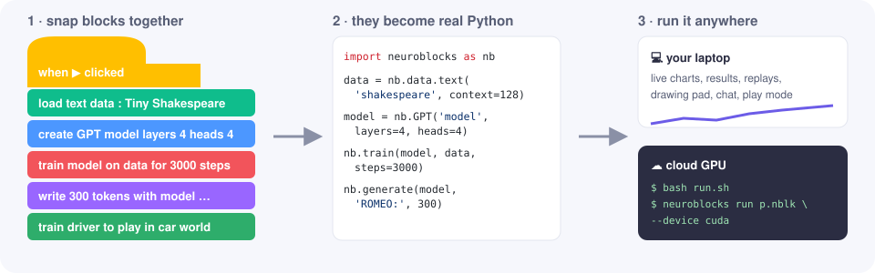

# NeuroBlocks 🧠🧩

**Scratch-style blocks for AI and machine learning.** Snap together a dataset, a model and a
`train` block, press the green flag, and watch it learn — live charts, decision maps, physics
replays. Then wire the trained weights into an **output stack** and build the model's output
yourself, step by step: text → tokens → scores for the next token → probabilities → a choice →
text again. Build a GPT from layer blocks, teach a car to drive over rough terrain, draw digits
for a CNN, compare classic ML models… then export the exact same program and run it on a big
cloud GPU from the command line.



## Quick start

**Windows:** double-click **`start.bat`**. The first run sets up a private Python environment
(PyTorch is reused if you have it); then the editor opens in your browser at
`http://localhost:8765`.

**Linux / macOS:** `bash start.sh`

**Manual:** `pip install -e .` then `neuroblocks gui` (or `python -m neuroblocks gui`).

Then click **✨ Examples**, pick one, and press **▶ Run**.

Your projects, data files, trained models and run logs live in `~/NeuroBlocks`
(`projects/`, `data/`, `models/`, `runs/`). Change it with `--home` or `NEUROBLOCKS_HOME`.

## Training stacks and output stacks

A program has two kinds of stacks, connected by a wire like in a node editor:

```
 start training when ▶ clicked            ○ start output
   load text  stories                       set prompt to "Once upon a time"
   create GPT language model  gpt           set tokens to (tokens of prompt)
   train gpt on stories                     repeat 300
   📦 weights of trained gpt  ● ──wire──▶      set scores to (scores for the next token after tokens)
                                               set probs to (probabilities from scores, temperature 0.8)
                                               add (pick a random choice from probs) to tokens
                                               show (text of tokens) as output
```

* The yellow **training stack** loads data, builds a model and trains it. It ends with the
  **📦 weights of trained …** block (nothing can go below it): it packs up the trained weights
  together with what's needed to use them — the tokenizer and context length of a language model,
  a classifier's class names and input scaling, a classic model's rules, a simulation policy.
* Drag a **wire** from its **●** to the **○** of a teal **start output** block. Drag from a ○ to
  unplug or move a wire; double-click a wire to remove it. Wires are saved with the project and
  work with undo. The wire's label shows what came through it after a run (e.g.
  `📦 gpt · 239K weights · 48 tokens`), and it animates while the output stack runs.
* The **output stack** is where the trained model gets used, and you build every step: turn
  input into numbers (*tokens of*, a list, *ask for a drawing*), *run the model* / *scores for
  the next token*, *probabilities from scores* (softmax with temperature), *pick a random / the
  most likely choice*, *name of choice*, *show the top N choices* (a live bar chart),
  *ask … and wait* / *answer*. Picture generators turn *random noise* into a *picture*;
  simulation policies loop *what the model senses → run the model → action from scores → do
  action* until *this try is over*. Everything appears in the **Output** tab.
* Output stacks run after all training stacks have finished. The Python export shows the same
  steps as plain code (`gpt_weights.next_token_scores(tokens)`, `nb.softmax(...)`, `nb.pick(...)`).

## The editor

| | |
|---|---|
| **Blocks** (left) | Colour-coded categories. Containers like *train*, *load dataset* and *create car world* hold small **setting** blocks; the puzzle shapes only let settings snap where they make sense. Right-click any block → *What does this block do?* |
| **▶ Run / ⏭ Skip / ⏹ Stop** | Run starts instantly (a warm worker process has PyTorch preloaded). *Skip* finishes the current training early and carries on. *quick test* shrinks every training loop to a few steps. The running block glows; a failing block gets a ⚠ with a plain-English explanation. |
| **Console** | Speech bubbles from *say*, progress bars, friendly errors, ✅/❌ test checks. |
| **Charts** | Live loss / accuracy / reward curves (smoothing, log scale). Every run of a loop gets its own line. |
| **Results** | Test tables, confusion matrices, decision maps (they animate while training), prediction galleries, generated text (streams in as it's written), scatter plots. |
| **Sim** | Physics replays: the car on terrain, a whole evolving population as ghosts, rockets, mazes with the learned policy as arrows. Scrub, slow down, follow the car. |
| **Output** | What output stacks make, newest at the bottom: what came through the wire, text written token by token, live top-choice bar charts, pictures, and *ask* boxes (text or a drawing pad). *let me play* (drive the car yourself with the arrow keys) also opens here. |
| **Model** | Every layer with its output shape and parameter count (auto-added layers are marked). Click a row to find its block. |
| **Data** | Dataset previews and class balance; upload CSV / text / zipped image folders. |
| **Python** | Your blocks as real, readable Python — copy it, download it, or make a cloud bundle. |

## What you can build

* **Data:** toy 2-D data (spirals, moons, XOR…), classic tables (iris, wine, diabetes, house
  prices), images (built-in 8×8 digits, MNIST, Fashion-MNIST, CIFAR-10, your own folders), text
  (Tiny Shakespeare, baby names, built-in toy stories, Python code, your own `.txt` or a web
  page), labelled texts (toy reviews, IMDB…), time series, CSV files, any Hugging Face dataset.
* **Neural networks** from layer blocks: dense, conv 2D, pooling, dropout, batch/layer norm,
  token & positional embeddings, **transformer blocks**, LSTM/GRU, upsample/reshape, plus
  structural **repeat N times { }** and **residual { }** blocks. Input sizes are inferred; the
  output layer sizes itself; a missing *flatten* is added for you (and you're told).
* **GPT language models** — prebuilt (*layers / heads / embedding size / dropout*) or built from
  layers; char / word / GPT-2 tokens; or fine-tune a pretrained Hugging Face model (e.g.
  `distilgpt2`). Their output stack spells out generation: next-token scores, temperature,
  sampling, and a live chart of the most likely next tokens.
* **Picture generators** (generative AI for images) — a VAE or a GAN learns from any image
  dataset and invents new pictures; ask it for a particular class ("draw a 7").
* **Training:** epochs or steps, batch size, Adam/AdamW/SGD/RMSprop, LR schedules with warm-up,
  weight decay, gradient clipping, early stopping, mixed precision and `torch.compile` on GPUs,
  autoencoder / denoising goals, *every N steps do { … }* event blocks, save-the-best checkpoints.
* **Testing:** accuracy, F1, confusion matrices, R², perplexity, prediction galleries, decision
  maps, PCA / t-SNE maps, **check that … ≥ …** test assertions (non-zero exit code on the CLI).
* **Classic ML:** decision trees (and their learned questions), random forests, gradient
  boosting, k-NN, SVMs, logistic/linear models, naive Bayes, k-means; feature importance.
* **Simulations & reinforcement learning:** a 2-D physics **car world you assemble from parts**
  — terrain (rough, hills, steps…), body, **abilities** (drive, brake, lean, jump, rocket boost),
  **senses** (speed, tilt, spin, ground radar rays, wheel contact, height, progress, fuel) and
  **rewards** (distance, speed, staying upright, finish bonus, flip/energy/time penalties, or your
  own formula from *world's speed/tilt/…* reporters) — plus cart-pole, mountain car, pendulum,
  rocket lander, mazes and flappy bird. Learn with **PPO**, **neuro-evolution** (a population of
  cars), **DQN** or a **Q-table**. The policy network is built with the same layer blocks.
* **Programming:** variables, lists, loops, if/else, functions ("My Blocks"), math & text,
  live custom charts, sounds — e.g. hyperparameter sweeps in a *for each* loop.

## What to expect on a laptop

Measured on a 2022 laptop CPU (Intel i7-1255U, no GPU), full-length runs of the examples:

| example | time | result |
|---|---|---|
| Untangle two spirals | 15 s | 100 % test accuracy, animated decision map |
| Read handwritten digits (CNN) | 22 s | 99.2 % |
| MNIST CNN | 2 min 20 s | 99.0 % on 10,000 test digits |
| Your first GPT (toy stories) | 1 min 25 s | writes coherent little stories |
| Invent new names | 1 min 40 s | plausible new names |
| Shakespeare GPT (laptop size) | 3 min 25 s | validation loss 1.82 — verse with character names; scale up on a GPU |
| Is this review positive? | 22 s | 100 %, gets "not boring at all" right |
| Draw new digits (VAE) | ~1 min 30 s | recognisable invented digits, any class on request |
| Car on rough terrain (PPO) | ~1 min 15 s | goes from 0.9 m to finishing the 120 m track |
| Evolve a car (mixed terrain) | ~2 min 30 s | population average 16 → 140; the champion finishes 150 m |
| Balance a pole (PPO) | ~55 s | perfect balance for the whole 20-second try |
| Flappy bird (evolution) | ~30 s | flies through 15 pipes |
| Escape the maze (Q-table) | ~12 s | finds the goal, arrows show the learned policy |

Bigger models (Shakespeare GPT at full size, CIFAR-10, fine-tuning GPT-2, the rocket lander) are
where a cloud GPU pays off.

## Running on a cloud GPU

Every project runs headless with the `neuroblocks` command — no browser or Node needed.

**1. Bundle it** — *File ▸ Export cloud GPU bundle* (or `neuroblocks bundle my.nblk`) gives a zip
containing the blocks, the same program as `train.py`, the NeuroBlocks runtime, your data files,
`requirements.txt`, `run.sh`, a `Dockerfile` and a README. On any Linux GPU machine (Lambda,
RunPod, Vast.ai, Paperspace, AWS, GCP, Colab…):

```bash
unzip my_project_bundle.zip -d job && cd job
bash run.sh --quick          # 1-minute smoke test
bash run.sh --set layers=8 --set embedding=512 --set steps=20000   # scale up hyperparameter blocks
```

Results land in `models/` (trained models — copy them back and use *load model from file*) and
`runs/<run>/` (`events.jsonl` + pictures; open with `neuroblocks view runs/<run>` to see the charts
and replays in the editor).

**2. Or watch it live** — on the GPU machine run `python -m neuroblocks serve --host 0.0.0.0`
(it prints an access token; or keep it private and use `ssh -L 9000:localhost:8765 gpu-box`). In
your local editor choose *Run on ▸ Add remote server*. Runs then execute remotely with live charts
and replays here; data files are uploaded for you and saved models are copied back automatically.

### Command line reference

```text
neuroblocks gui [--port 8765] [--home DIR]          open the editor
neuroblocks run PROJECT.nblk|SCRIPT.py [--device cuda] [--quick] [--set name=value …]
neuroblocks export PROJECT.nblk -o train.py         blocks → plain Python
neuroblocks bundle PROJECT.nblk -o job.zip          everything for another machine
neuroblocks serve --host 0.0.0.0 [--token T]        remote run server (token protected)
neuroblocks view runs/<run>                         open a finished run's results
neuroblocks blocks [--markdown]                     block reference
neuroblocks examples [--copy DIR]                   list / copy example projects
neuroblocks doctor                                  check PyTorch, GPU, optional packages
```

Ctrl+C once during `neuroblocks run` finishes the current training early (like *Skip*); twice stops.

### GPU setup notes

The default `pip install torch` on Windows is CPU-only. For an NVIDIA GPU install the CUDA build
from <https://pytorch.org/get-started/locally/> (e.g. `pip install torch --index-url
https://download.pytorch.org/whl/cu124`). Cloud GPU images usually already have it — `run.sh`
reuses an installed PyTorch. Apple Silicon uses the MPS GPU automatically.

Optional extras: `pip install -e ".[text]"` (GPT-2 tokenizer), `".[huggingface]"` (pretrained
models & datasets), `".[all]"`.

## How it works

```
 Browser: Blockly editor + panels ──HTTP/WebSocket──▶ Python server (FastAPI)
                                                          │ compiles blocks → Python
                                                          ▼
                                  worker process:  import neuroblocks as nb  (PyTorch, scikit-learn, pymunk)
                                                          │ JSON events: metrics, images, replays, which block runs…
                                                          ▼
                                  editor panels   ·   or pretty terminal output + events.jsonl on the CLI
```

* Every block is defined once in Python (`neuroblocks/compiler/blocks_*.py`): its look, toolbox
  entry, help text and code generator. The browser downloads the definitions, so the editor,
  compiler, CLI and docs never disagree. `neuroblocks blocks --markdown` prints the reference.
* Blocks compile to ordinary Python using the `nb` runtime (`neuroblocks/runtime/`), so the
  exported script is something you can read, edit and learn from.
* See [DESIGN.md](DESIGN.md) for the design brainstorm and architecture notes.

## Development

```bash
pip install -e ".[dev]"
python scripts/make_examples.py      # regenerate example projects
python -m pytest                     # compiler, runtime, server and simulation tests
```

Project layout: `neuroblocks/compiler` (block DSL, blocks, compiler, toolbox),
`neuroblocks/runtime` (data, layers, models, training, evaluation, generation, classic ML,
`rl/` worlds & algorithms), `neuroblocks/server` (API, run manager, remote proxy),
`neuroblocks/static` (the editor), `neuroblocks/examples`, `scripts/`, `tests/`.

Blockly (Apache-2.0) and Chart.js (MIT) are bundled in `neuroblocks/static/vendor`.
